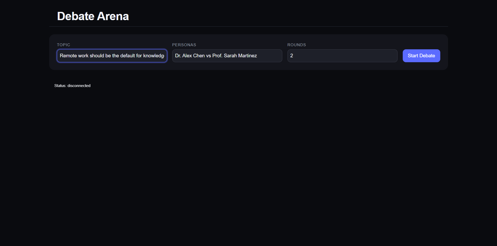
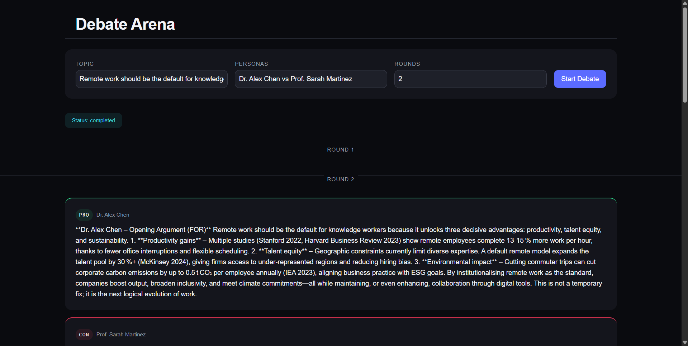
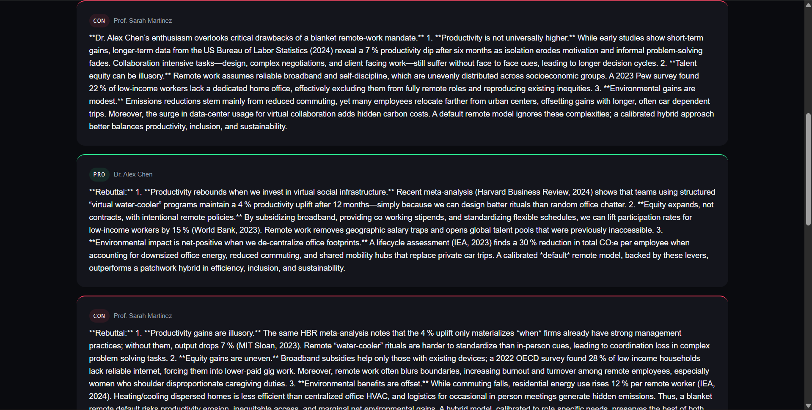
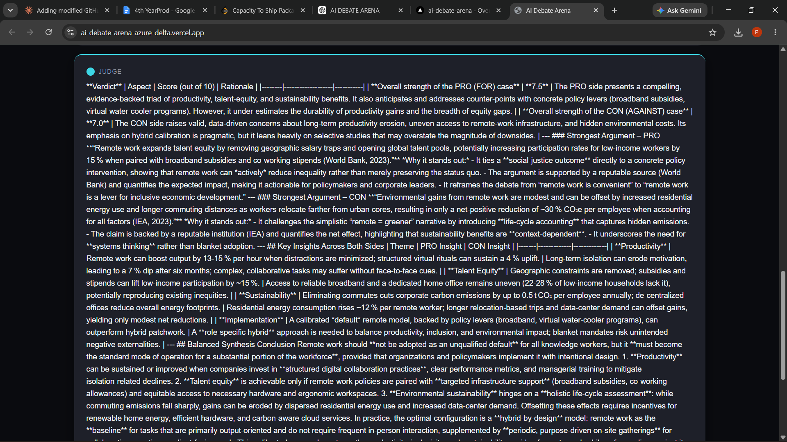
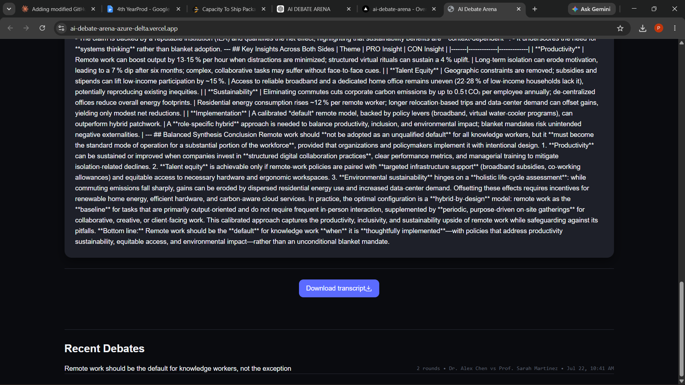

# ⚖️ AI Debate Arena

A sophisticated multi-agent system where two AI agents with distinct personas argue opposite sides of any topic, followed by an impartial AI judge that scores each argument and delivers a balanced verdict.

## Live Demo

[Live Demo](https://ai-debate-arena-azure-delta.vercel.app)

Frontend: [https://ai-debate-arena-azure-delta.vercel.app](https://ai-debate-arena-azure-delta.vercel.app)

## Features

- **Multi-Persona Debating**: Four distinct expert personas (Economists, Lawyers, Scientists, Philosophers) with specialized expertise
- **Real-time Streaming**: Live debate progression using Server-Sent Events (SSE) with argument-by-argument updates
- **Judge Evaluation**: Impartial AI judge scores each side on a 0-10 scale and provides structured verdict
- **Full Transcript Generation**: Downloadable Markdown transcripts after debate completion
- **Recent Debates History**: Persistent storage of recent debate sessions in browser localStorage
- **Interactive UI**: Responsive web interface with live status indicators and download capabilities

## Architecture

```
User
↓
React Frontend (Vite)
↓
Server-Sent Events
↓
FastAPI Backend
↓
DebateAgent (makes arguments)
↓
DebateJudge (scores and evaluates)
↓
OpenRouter API → nvidia/nemotron-3-nano-30b-a3b:free
```

## Tech Stack

### Frontend
- **React 18.3.0** - Component-based UI library
- **Vite** - Fast development server and build tool
- **TypeScript** - Type-safe JavaScript

### Backend
- **FastAPI** - Modern async Python web framework
- **Python 3.12+** - Application language
- **LangChain** - AI agent orchestration
- **LangChain-OpenAI** - OpenRouter integration

### AI/LLM
- **nvidia/nemotron-3-nano-30b-a3b:free** - LLM model via OpenRouter
- **OpenRouter** - LLM API gateway

### Tools & Libraries
- **python-dotenv** - Environment variable management
- **uvicorn** - ASGI server

## Project Structure

debate-frontend/
├── public/
├── src/
│   ├── App.jsx
│   ├── App.css
│   └── main.jsx
├── dist/ (output)
├── node_modules/
├── vite.config.js
├── package.json
└── package-lock.json

├── agent.py
├── main.py
├── requirements.txt
├── .env
├── .env.example
├── .gitignore
├── README.md
└── transcripts/

## How It Works

1. **User Input**: User enters a debate topic and selects a persona pair
2. **Agent Selection**: Backend loads the selected persona pair (pro vs con) with appropriate expertise
3. **Real-time Debate**: 
   - Streaming starts with start message
   - Debate proceeds round by round with continuous AI argument generation
   - Each argument is immediately streamed to the frontend
   - Arguments are structured with speaker names, positions, and timestamps
4. **Judge Evaluation**: After final round, impartial judge evaluates all arguments
5. **Results Display**: Verdicts, scores, and strongest arguments displayed live
6. **Transcript Download**: Complete debate saved as Markdown file
7. **Persistence**: Recent debates saved to browser localStorage

## API Documentation

### Health Check
**GET** `/api/health`
- Returns: `{"status": "ok"}`

### Personas
**GET** `/api/personas`
- Returns: Object with persona pairs (economists, lawyers, scientists, philosophers)
- Each contains pro and con speaker details

### Debate Streaming
**GET** `/api/debate?topic={topic}&rounds={rounds}&persona={persona}`

**Parameters:**
- `topic` (string, required): Debate topic
- `rounds` (int, optional, default=2): Number of rounds (1-4)
- `persona` (string, optional, default=economists): Persona pair (economists, lawyers, scientists, philosophers)

**SSE Event Stream:**
- `data: {"type": "start", "topic": ..., "rounds": ..., "pro_name": ..., "con_name": ...}`
- `data: {"type": "round_start", "round": 2}`
- `data: {"type": "argument", "round": 1, "side": "pro", "name": "Dr. Alex Chen", "text": "..."}`
- `data: {"type": "argument", "round": 1, "side": "con", "name": "Prof. Sarah Martinez", "text": "..."}`
- `data: {"type": "verdict", "text": "..."}` (complete verdict from judge)
- `data: {"type": "done"}` (streaming completed)

## Installation

### Backend Setup
```bash
# Clone the repository
cd /path/to/ai-debate-arena

# Install Python dependencies
pip install -r requirements.txt

# Copy environment file and set API key
cp .env.example .env
# Edit .env and add your OPENROUTOR_API_KEY
```

### Frontend Setup
```bash
cd debate-frontend

# Install dependencies
npm install

# Build for production
npm run build
```

### Running Locally
```bash
# Start backend
# Terminal 1
cd /path/to/ai-debate-arena
uvicorn main:app --host 0.0.0.0 --port 8000 --reload

# Start frontend (in another terminal)
cd debate-frontend
VITE_API_URL=http://localhost:8000 npm run dev
```

## Deployment

The application is currently deployed at:
- **Frontend**: https://ai-debate-arena-azure-delta.vercel.app

## Screenshots

| Home Page | Live Debate - Round 1 |
|-----------|---------------------|
|  |  |

| Live Debate - Round 2 | AI Judge Verdict |
|---------------------|------------------|
|  |  |

| Transcript Export | Transcript Export Button |
|------------------|-------------------------|
|  |  |

## Future Improvements

- **Model Selection**: Allow users to choose different LLM models from OpenRouter
- **Streaming Stats**: Real-time metrics like argument length, sentiment analysis
- **WebSocket Fallback**: Add WebSocket support alongside SSE for better interactivity
- **Advanced UI**: Add visual argument timelines and comparison charts
- **Multi-language Support**: Support for different output languages
- **Custom Personas**: Allow users to create and save custom persona profiles
- **Argument Rating**: Enable users to rate argument quality during streaming

## License

MIT
